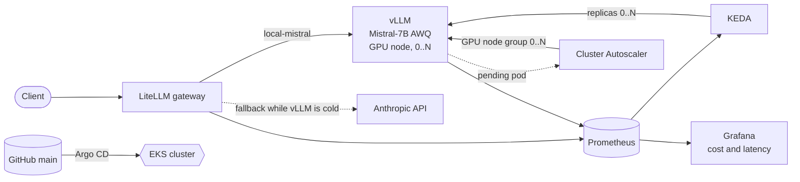

# LLM Platform on EKS

[](https://github.com/yack300/llm-platform-on-eks/actions/workflows/ci.yml)

Reference platform demonstrating serving, gateway, RAG, cost observability, and
security for LLM inference workloads on Kubernetes (EKS), using the same GitOps
pattern (Terraform for AWS, Argo CD for everything in the cluster) used in production.

The GPU scales to zero: when nobody is using the model, both the vLLM pod and
the GPU node go away, and the next request wakes them up again while the
gateway falls back to an external provider.

## Results from a real EKS run

Measured on EKS 1.36 with one `g4dn.xlarge` (NVIDIA T4) serving Mistral-7B AWQ
through the LiteLLM gateway. Full numbers, method and caveats in
[docs/cost-comparison.md](docs/cost-comparison.md).

| Concurrent requests | Output tokens/s | p50 latency | Cost per 1M output tokens (on-demand / spot) |
|---|---|---|---|
| 1 | 50 | 2.54 s | $2.90 / $1.49 |
| 4 | 186 | 2.75 s | $0.79 / $0.40 |
| 8 | 342 | 2.98 s | $0.43 / $0.22 |

- **Scale-to-zero, end to end:** request → KEDA 0→1 → Cluster Autoscaler adds
  a GPU node from 0 → first local response in ~8–9 min (mostly the 8.7 GB
  image pull). Idle, vLLM is back at 0 in ~5 min and the GPU node is gone in ~18 min.
- **Same GPU, ~6.8x the throughput** going from 1 to 8 concurrent requests,
  with p50 latency only going from 2.5 s to 3 s (vLLM continuous batching).
- **Bugs that only showed up on real infrastructure**, fixed in this repo:
  KEDA never seeing the first request after a gateway restart, the NVIDIA
  device plugin crash-looping on CPU nodes, DNS blocked between node groups,
  a 20 GiB disk too small for the image, liveness probes killing the cold
  start, a rolling-update deadlock on a single GPU, and a Qdrant volume that
  would have survived the teardown (and kept billing).

## Architecture



Terraform provisions only AWS resources (EKS, node groups, IAM via Pod
Identity). Everything inside the cluster is deployed by Argo CD from this
repo, after CI (Checkov, Trivy, GitLeaks, kubeconform, Kyverno, Terraform
validate) passes on `main`.

## Project layers

| # | Layer | Main tool | What it demonstrates |
|---|------|------------------------|----------------|
| 1 | Serving | vLLM + KEDA | MLOps: deploying and autoscaling an LLM on K8s |
| 2 | Model Gateway | LiteLLM | AI Platform Engineering: unified multi-provider proxy |
| 3 | RAG | Qdrant | End-to-end retrieval-augmented generation pipeline |
| 4 | Cost observability | Prometheus + Grafana + OpenCost/Kubecost | FinOps applied to AI: cost per request/token |
| 5 | Security | Trivy, Checkov, Kyverno, GitLeaks | DevSecOps: shift-left in the pipeline and in the cluster |

## Repo structure

```
llm-platform-on-eks/
├── terraform/
│   ├── bootstrap/            # One-time bootstrap: S3 bucket for remote state (native S3 locking)
│   ├── modules/
│   │   └── eks-gpu-nodegroup/  # GPU node group: IAM role, taint, spot capacity_type
│   ├── main.tf                # EKS cluster (official module) + base node group + GPU node group
│   └── backend.hcl.example    # S3 backend template (copy to backend.hcl, gitignored)
├── k8s/
│   ├── vllm/                  # Deployment (GPU) + local-cpu-mock (Ollama) + Service + KEDA ScaledObject
│   ├── litellm/                # Gateway: Deployment + ConfigMap (real vs. local) (routing/rate limits)
│   ├── qdrant/                  # Vector DB for RAG (Helm values)
│   ├── argocd/                 # Argo CD: install values, root app-of-apps, one Application per component
│   ├── storage/                # Default gp3 StorageClass (EKS ships none)
│   ├── gpu/                     # NVIDIA device plugin DaemonSet
│   ├── security/                # Kyverno policies + Trivy-operator config
│   └── observability/         # kube-prometheus-stack values + ServiceMonitors (cost/latency)
├── .github/workflows/ci.yml   # GitHub Actions: GitLeaks + Checkov + Trivy fs -> kubeconform, Kyverno, Terraform
│                               # (no build/push: no custom image, Argo CD syncs main directly)
├── docs/
│   └── cost-comparison.md      # Measured throughput, latency, cost per token and scale-to-zero timings
└── scripts/
    ├── deploy-local.sh         # Fast bootstrap on kind/minikube (no GPU, Ollama mock)
    ├── bootstrap-argocd.sh     # EKS: install Argo CD, create the LiteLLM secret, apply the root app
    └── teardown-eks.sh         # EKS: delete apps and PVC volumes before terraform destroy
```

## Getting started (recommended order)

1. `scripts/deploy-local.sh` — spins up a local kind cluster, installs Prometheus/Grafana,
   Kyverno, Qdrant, and a CPU inference mock (Ollama) to test the gateway, RAG, and
   security policies without spending on GPU.
2. Once the logic works locally:
   a. `cd terraform/bootstrap && terraform init && terraform apply` — creates the S3
      bucket for remote state (done once).
   b. Copy the `backend_hcl` output to `terraform/backend.hcl` (see `backend.hcl.example`).
   c. `cd terraform && terraform init -backend-config=backend.hcl && terraform apply
      -var='admin_cidrs=["<your-ip>/32"]'` against real AWS, to create the EKS cluster and
      the node groups (spot instances).
   d. `./scripts/bootstrap-argocd.sh` — installs Argo CD and applies the root
      app-of-apps; from then on Argo CD deploys everything else from this repo
      (`k8s/argocd/apps/`), in order, excluding the `*-local*` files.
3. **Important:** when you're done, run `./scripts/teardown-eks.sh` (deletes the
   apps and the EBS volumes behind PVCs, which `terraform destroy` would orphan),
   then `terraform destroy` in `terraform/`. The Cluster Autoscaler removes idle GPU nodes,
   but the EKS control plane and the platform nodes are billed hourly while they exist.

## Current status

Validated end to end on a real AWS account (2026-10-06): `terraform apply`,
Argo CD sync of every component, scale-to-zero and wake-up through the
Cluster Autoscaler, benchmark, and teardown with no resources left behind.

Known gaps:
- Spot GPU capacity isn't always available (it wasn't on the first run);
  `-var='use_spot_gpu_nodes=false'` switches the GPU node group to on-demand.
- Grafana's admin password is generated by the chart and doesn't survive an
  Argo CD re-render; it should come from a Secret created at bootstrap.
- KEDA's `cooldownPeriod` is shorter than the ~8-minute cold start.
- The `kyverno` Application shows OutOfSync on its policy CRDs.
- `require-image-signature.yaml` ships in `Audit` mode with placeholder
  registry/key values — only relevant once a custom-built image exists (see
  `k8s/security/kyverno-policies/require-image-signature.yaml`).
- OpenCost (infra-side cost) and the RAG ingestion pipeline aren't installed yet.
